[Docker Flow](https://github.com/vfarcic/docker-flow) is a project aimed towards creating an easy to use continuous deployment flow. It depends on [Docker Engine](https://www.docker.com/products/docker-engine), [Docker Compose](https://www.docker.com/products/docker-compose), [Consul](https://www.consul.io/), and [Registrator](https://github.com/gliderlabs/registrator). Each of those tools is proven to bring value and are recommended for any Docker deployment.

The goal of the project is to add features and processes that are currently missing inside the Docker ecosystem. The project, at the moment, solves the problems of blue-green deployments, relative scaling, and proxy service discovery and reconfiguration. Many additional features will be added soon.

The current list of features is as follows.

* Blue-green deployment
* Relative scaling
* Proxy reconfiguration

The latest release can be found [here](https://github.com/vfarcic/docker-flow/releases/latest).

The Standard Setup
==================

We'll start by exploring a typical Swarm cluster setup and discuss some of the problems we might face when using it as the cluster orchestrator. If you are already familiar with Docker Swarm, feel free to skip this section and jump straight into [The Problems](#the-problems).

As a minimum, each node inside a Swarm cluster has to have [Docker Engine](https://www.docker.com/products/docker-engine) and with the [Swarm container](https://hub.docker.com/_/swarm/) running. That container should acts as a node. On top of those nodes, we need at least one Swarm container running as master and all Swarm nodes should announce their existence to it.

A combination of Swarm master(s) and nodes is a minimal setup that, in most cases, is far from sufficient. Optimum utilization of a cluster means that we are not in control any more. Swarm is. It will decide which node is the most appropriate place for a container to run. That choice can be as simple as a node with the least number of container running or can be based on a more complex calculation that involves amount of available CPU and memory, type of hard disk, affinity, and so on. No matter that strategy we choose, the fact is that we will not know where will a container be run. On top of that, we should not specify ports our services should expose. "Hard-coded" ports reduce our ability to scale services and can result in conflicts (after all, two separate processes cannot listen to the same port). Long story short, once we adopt Swarm, both IPs and ports of our services will become unknown. So, the next step in setting up a Swarm cluster is to create a mechanism that will detect deployed services and store their information in a distributed registry so that the information is easily available.

[Registrator](https://github.com/gliderlabs/registrator) is one of the tools that we can use to monitor Docker Engine events and send the information about deployed or stopped containers to a service registry. While there are many different service registries we can use, [Consul](https://www.consul.io/) proved to be, currently, the best one. Please read the [Service Discovery: Zookeeper vs etcd vs Consul](https://technologyconversations.com/2015/09/08/service-discovery-zookeeper-vs-etcd-vs-consul/) article for more information.

With Registrator and Consul, we are able to obtain information about any of the services running inside the Swarm cluster. A diagram of the setup we discussed, is as follows.

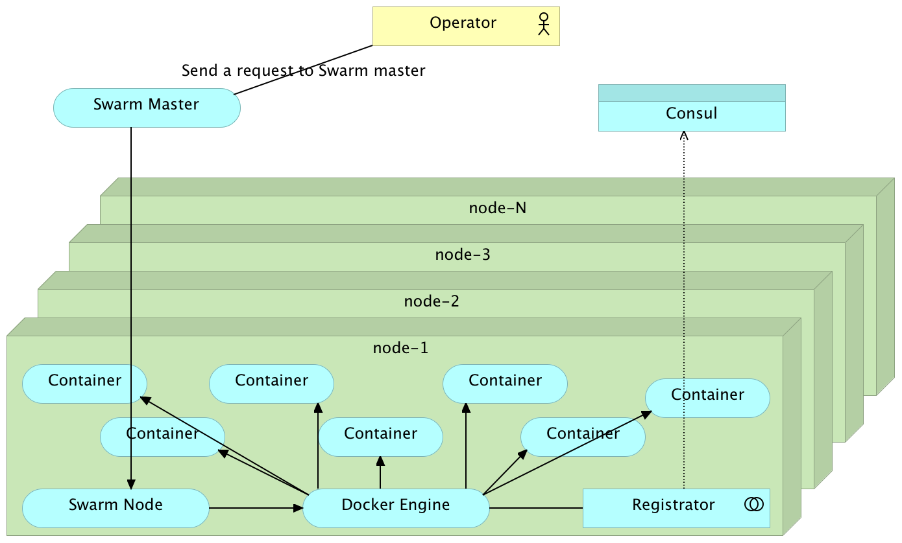

Please note that anything but a small cluster would have multiple Swarm masters and Consul instances thus preventing any lost of information or downtime in case one of them fails.

The process of deploying containers, in such a setup, is as follows.

* Operator sends a request to *Swarm master* to deploy a service consisting of one or multiple containers. This request can be sent through *Docker CLI* by defining the *DOCKER_HOST* environment variable with the IP and the port of the *Swarm master*.
* Depending on criteria sent in the request (CPU, memory, affinity, and so on), *Swarm master* makes the decision where to run the containers and sends sends requests chosen *Swarm nodes*.
* *Swarm node*, upon receiving the request to run (or stop) a container invokes local *Docker Engine* which, in turn, runs (or stops) the desired container and publishes the result as an event.
* *Registrator* monitors *Docker Engine* and, upon detecting a new event, sends the information to *Consul*.
* Anyone interested in data about containers running inside the cluster can consul *Consul*.

While this process is a great improvement when compared to the ways we were operating clusters in the past, it is far from complete and creates quite a few problems that should be solved.

The Problems
============

In this article, I will focus on three major problems or, to be more precise, features missing in the previously described setup.

Deploying Without Downtime
--------------------------

When a new release is pulled, running `docker-compose up` will stop the containers running the old release and run the new one in their place. The problem with that approach is downtime. Between stopping the old release and running the new in its place, there a downtime. No matter whether it is one millisecond or a full minute, a new container needs to start and the service inside it needs to initialize.

We can solve this by setting up a proxy and health check. However, that would still require that you run multiple instances of the service (as you definitelly should). The process would be to stop one instance and bring the new release in its place. During the downtime of that instance, proxy would redirect the requests to one of the other instances. Then, when the first instance is running the new release and the service inside it is initialized, you would continue repeating the process with the other instances. This process can become very complicated, and would prevent you from using Docker Compose *scale* command.

The better solution is to deploy new release using the *blue-green* deployment process. If you are unfamiliar with it, please read the [Blue-Green Deployment](https://technologyconversations.com/2016/02/08/blue-green-deployment/) article. In a nutshell, the process deploys the new release in parallel with the old one. Throughout the process, proxy should continue sending all requests to the old release. Once the deployment is finished and the service inside the container is initialized, proxy should be reconfigured to send all the request to the new release and the old one can be stopped.

Scaling Containers Using Relative Numbers
-----------------------------------------

*Docker Compose* makes it very easy to scale services to a fixed number. We can specify how many instances of a container we want to run and watch the magic unfold. When combined with Docker Swarm, the result is an easy way to manage containers inside a cluster. Depending on how many instances are already running, Docker Compose will increase (or decrease) the number of running containers so that the desired number of instances is achieved.

The problem is that Docker Compose always expects a fixed number as the parameter. I found this very limiting when dealing with production deployments. In many cases, we do not want to need to know how many instances are already running but, simply, send a signal to increase (or decrease) the capacity by some factor. For example, we might have an increase in traffic and want to increase the capacity by three instances. Similarly, if the demand for some service decreases, we might want the number of running instances to decrease as well and, in that way, free resources for other services and processes. This necessity is even more evident when we move towards autonomous and automated [Self-Healing Systems](http://technologyconversations.com/2016/01/26/self-healing-systems/) where human interactions are reduced to a minimum.

On top of the lack of relative scaling, *Docker Compose* does not know how to maintain the same number of running instances when a new container is deployed.

Proxy Reconfiguration After The New Release Is Tested
-----------------------------------------------------

The need for dynamic reconfiguration of the proxy becomes evident soon after we adopt microservices architecture. Containers allow us to pack them as immutable entities and Swarm lets us deploy them inside the cluster. The adoption of immutability through containers and cluster orchestrators like Swarm resulted in a huge increase in interest and adoption of microservices and, with them, decrease in deployment frequency. Unlike monolithic applications that forced us to deploy infrequently, now we can deploy often. Even if you do not adopt continuous deployment (each commit goes to production), you are likelly to start deploying your microservices more often. That might be once a week, once a day, or multiple times a day. No matter the frequency, there is a strong need to reconfigure the proxy every time a new release is deployed. Swarm will run containers somewhere inside the cluster and proxy needs to be reconfigured to redirect requests to all the instances of the new release. Proxy needs to be reconfigured dynamically. That means that there must be a process that retrieves information from the service registry, changes the configuration of the proxy and, finally, reload it.

There are several commonly used approaches to this problem.

Manual proxy reconfiguration should be discarded for obvious reasons. Frequent deploys mean that there is no time for an operator to manually change proxy configuration. Even if time is not of essence, manual reconfiguration add "human factor" to the process and we are known to make mistakes.

There are quite a few tools that monitor Docker events or entries to the registry and reconfigure proxy whenever a new container is run or an old one is stopped. The problem with those tools is that they do not give us enough time to test the new release. If there is a bug or a feature is not fully complete, our users will suffer. Proxy reconfiguration should be performed only after a set of tests is run and the new release is validated.

We can incorporate tools like [Consul Template](https://github.com/hashicorp/consul-template) or [ConfD](https://github.com/kelseyhightower/confd) into our deployment scripts. Both are truly great and work well but require quite a lot of plumbing before they are truly incorporated into the deployment process.

Solving The Problems
--------------------

[Docker Flow](https://github.com/vfarcic/docker-flow) is the project that solves the problems we discussed. It's goal is to provide features that are not currently available in Docker's ecosystem. It does not replace any of the ecosystem's features, but builds on top of them.

Docker Flow Walkthrough
=======================

The examples that follow will use [Vagrant](https://www.vagrantup.com/) to simulate a [Docker Swarm](https://www.docker.com/products/docker-swarm) cluster. That does not mean that the usage of **Docker Flow** is limited to Vagrant. You can use it with a single [Docker Engine](https://www.docker.com/products/docker-engine) or a Swarm cluster set up in any other way.

For similar examples based on [Docker Machine](https://www.docker.com/products/docker-machine) (tested on Linux and OS X), please read the [project README](https://github.com/vfarcic/docker-flow).

Setting it up
-------------

Please make sure that [Vagrant](https://www.vagrantup.com/) is installed before running the examples. You will not need anything else since the scripts we are about to run will make sure that all the tools are properly provisioned.

Please clone the code from the [vfarcic/docker-flow](https://github.com/vfarcic/docker-flow) repository.

```sh
git clone https://github.com/vfarcic/docker-flow.git

cd docker-flow
```

With the code downloaded, we can run Vagrant and create the cluster we'll use throughout the the of this article.

```bash
vagrant plugin install vagrant-cachier

vagrant up master node-1 node-2 proxy
```

Once VMs are created and provisioned, the setup will be the same as explained in *The Standard Setup* section of this article. The *master* server will container *Consul* and *Swarm master*, while *node-1* and *node-2* will form the cluster. Each of those nodes will have *Registrator* pointing to the *Consul* instance running in the *master* server as well as *Swarm node* connected to the *Swarm master*.


Please note that this setup is for demo purposes only. While the same principle should be applied in production, you should aim at having multiple Swarm masters and Consul instances in order to avoid potential downtime in case one of them fails.

Once the `vagrant up` command is finished, we can enter the *proxy* VM and see *Docker Flow* in action.

```bash
vagrant ssh proxy
```

> We'll run all the examples from the *proxy* machine. However, in production, you should run deployment commands from a separate machine (even your laptop).

The latest release of *docker-flow* binary has been downloaded and ready to use and the */books-ms* directory contains the *docker-compose.yml* file we'll use in the examples that follow

```bash
cd /books-ms
```

Reconfiguring Proxy After Deployment
------------------------------------

*Docker Flow* requires the Consul address as well as the information about the node the proxy is (or will be) running on. It allows three ways to provide the necessary information. We can define arguments inside the *docker-flow.yml* file, as environment variables, or as command line arguments. In this example, we'll use all three input methods so that you can get familiar with them and choose the combination that suits you needs.

Let's start by defining proxy and Consul data through environment variables.

```bash
export FLOW_PROXY_HOST=proxy

export FLOW_CONSUL_ADDRESS=http://10.100.198.200:8500

export FLOW_PROXY_DOCKER_HOST=tcp://proxy:2375

export DOCKER_HOST=tcp://master:2375

export BOOKS_MS_VERSION=":latest"
```

The *FLOW_PROXY_HOST* variable is the IP of the host where the proxy is running while the *FLOW_CONSUL_ADDRESS* represents the full address of the Consul API. The *FLOW_PROXY_DOCKER_HOST* is the host of the Docker Engine running on the server with the proxy. The last variable (*DOCKER_HOST*) is the address of the *Swarm master*. Even though, in this example, we're running *Consul*, *proxy*, and *Swarm master* on the same server, *Docker Flow* is designed to run operations on multiple servers at the same time so we need to provide it with all the information it needs to do its tasks. In the examples we are exploring, it will deploy containers on the Swarm cluster, use Consul instance to store and retrieve information, and reconfigure the proxy every time a new service is deployed. Finally, we set the environment variable *BOOKS_MS_VERSION* to *latest*. The *docker-compose.yml* that we'll use uses it do determine which version we want to run.

Now we are ready to deploy the first release of our sample service.

```bash
docker-flow \
    --blue-green \
    --target=app \
    --service-path="/api/v1/books" \
    --side-target=db \
    --flow=deploy --flow=proxy
```

We instructed `docker-flow` to use the *blue-green deployment* process and that the target (defined in [docker-compose.yml](https://github.com/vfarcic/docker-flow/blob/master/docker-compose.yml)) is *app*. We also told it that the service exposes an API on the address */api/v1/books* and that it requires a side (or secondary) target *db*. Finally, through the `--flow` arguments we specified that the we want it to deploy the targets and reconfigure the proxy. A lot happened in that single command so we'll explore the result in more detail.

Let's take a look at our servers and see what happened. We'll start with the Swarm cluster.

```bash
docker ps --format "table {{.Names}}\t{{.Image}}"
```

The output of the `ps` command is as follows.

```
NAMES                                IMAGE
node-2/dockerflow_app-blue_1   vfarcic/books-ms
node-1/books-ms-db             mongo
...
```

*Docker Flow* run our main target *app* together with the side target named *books-ms-db*. Both targets are defined in [docker-compose.yml](https://github.com/vfarcic/docker-flow/blob/master/docker-compose.yml). Container names depend on many different factors, some of which are the Docker Compose project (defaults to the current directory as in the case of the *app* target) or can be specified inside the *docker-compose.yml* through the `container_name` argument as in the case of the *db* target). The first difference you'll notice is that *Docker Flow* added *blue* to the container name. The reason behind that is in the `--blue-green` argument. If present, *Docker Flow* will use the *blue-green* process to run the primary target. If you are unfamiliar with the process, please read the [Blue-Green Deployment](http://technologyconversations.com/2016/02/08/blue-green-deployment/) article for general information and [Docker Flow: Blue-Green Deployment and Relative Scaling](http://technologyconversations.com/2016/03/07/docker-flow-blue-green-deployment-and-relative-scaling/) for a more detailed explanation within the *Docker Flow* context.

Let's take a look at the *proxy* node as well.

```bash
export DOCKER_HOST=tcp://proxy:2375

docker ps --format "table {{.Names}}\t{{.Image}}"
```

The output of the `ps` command is as follows.

```
NAMES               IMAGE
docker-flow-proxy   vfarcic/docker-flow-proxy
consul              progrium/consul
```

*Docker Flow* detected that there was no *proxy* on that node and run it for us. The *docker-flow-proxy* container contains *HAProxy* together with custom code that reconfigures it every time a new service is run. For more information about the *Docker Flow: Proxy*, please read the [project README](https://github.com/vfarcic/docker-flow-proxy).

Since we instructed Swarm to deploy the service somewhere inside the cluster, we could not know in advance which server will be chosen. In this particular case, our service ended up running inside the *node-2*. Moreover, to avoid potential conflicts and allow easier scaling, we did not specify which port the service should expose. In other words, both the IP and the port of the service were not defined in advance. Among other things, *Docker Flow* solves this by running *Docker Flow: Proxy* and instructing it to reconfigure itself with the information gathered after the container is run. We can confirm that the proxy reconfiguration was indeed successful by sending an HTTP request to the newly deployed service.

```bash
curl -I proxy/api/v1/books
```

The output of the `curl` command is as follows.

```
HTTP/1.1 200 OK
Server: spray-can/1.3.1
Date: Thu, 07 Apr 2016 19:23:34 GMT
Access-Control-Allow-Origin: *
Content-Type: application/json; charset=UTF-8
Content-Length: 2
```

The flow of the events was as follows.

1. **Docker Flow** inspected *Consul* to find out which release (*blue* or *green*) should be deployed next. Since this is the first deployment and no release is running, it decided to deploy it as *blue*.
2. **Docker Flow** sent the request to deploy the *blue* release to *Swarm Master*, which, in turn, decided to run the container in the *node-2*. *Registrator* detected the new event created by *Docker Engine* and registered service information in *Consul*. Similarly, the request was sent to deploy the side target *db*.
3. **Docker Flow** retrieved the service information from *Consul*.
4. **Docker Flow** inspected the server that should host the proxy, realized that it is not running, and deployed it.
5. **Docker Flow** updated *HAProxy* with service information.


Even though our service is running in one of the servers chosen by Swarm and is exposing a random port, the proxy was reconfigured and our users can access it through a fixed IP and without a port (to be more precise through standard HTTP port 80 or HTTPS port 443).

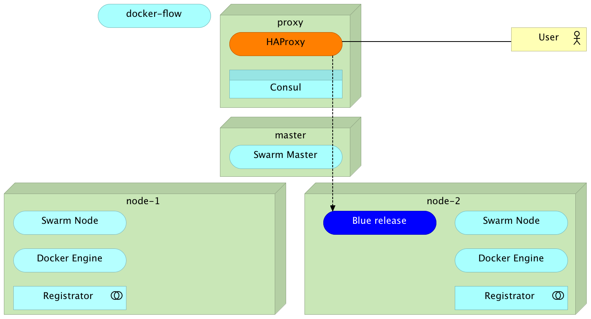

Let's see what happens when the second release is deployed.

Deploying a New Release Without Downtime
----------------------------------------

After some time and developers will push a new commit and we want to deploy a new release of the service. We do not want to have any downtime so we'll continue using the *blue-green* process. Since the current release is *blue*, the new one will be named *green*. Downtime will be avoided by running the new release (*green*) in parallel with the old one (*blue*) and after it is fully up and running, reconfigure the proxy so that all requests are sent to the new release. Only after the proxy is reconfigured, we want the old release to stop running and release the resources it was using. We can accomplish all that by running a `docker-flow` command. However, this time, we'll leverage the [docker-flow.yml](https://github.com/vfarcic/docker-flow/blob/master/docker-flow.yml) file that already has some of the arguments we used before.

The content of the [docker-flow.yml](https://github.com/vfarcic/docker-flow/blob/master/docker-flow.yml) is as follows.

```yml
target: app
side_targets:
  - db
blue_green: true
service_path:
  - /api/v1/books
```

Let's run the new release.

```bash
export DOCKER_HOST=tcp://master:2375

docker-flow \
    --flow=deploy --flow=proxy --flow=stop-old
```

Just like before, we should explore the Docker processes and see the result.

```bash
docker ps -a --format "table {{.Names}}\t{{.Image}}\t{{.Status}}"
```

The output of the `ps` command is as follows.

```bash
NAMES                        IMAGE                    STATUS
node-1/booksms_app-green_1   vfarcic/books-ms         Up 33 seconds
node-2/booksms_app-blue_1    vfarcic/books-ms         Exited (137) 22 seconds ago
node-1/books-ms-db           mongo                    Up 41 minutes
...
```

From the output, we can observe that the new release (*green*) is running and that the old (*blue*) was stopped. The reason the old release was only stopped and not entirely removed lies in potential need to quickly roollback in case a problem is discovered at some later moment in time.

Let's confirm that the proxy was reconfigured as well.

```bash
curl -I proxy/api/v1/books
```

The output of the `curl` command is as follows.

```
HTTP/1.1 200 OK
Server: spray-can/1.3.1
Date: Thu, 07 Apr 2016 19:45:07 GMT
Access-Control-Allow-Origin: *
Content-Type: application/json; charset=UTF-8
Content-Length: 2
```

The flow of the events was as follows.

1. **Docker Flow** inspected *Consul* to find out which release (*blue* or *green*) should be deployed next. Since the previous release was blue, it decided to deploy it as *green*.
2. **Docker Flow** sent the request to deploy the *green* release to *Swarm Master*, which, in turn, decided to run the container in the *node-1*. *Registrator* detected the new event created by *Docker Engine* and registered service information in *Consul*.
3. **Docker Flow** retrieved the service information from *Consul*.
4. **Docker Flow** updated *HAProxy* with service information.
5. **Docker Flow** stopped the old release.

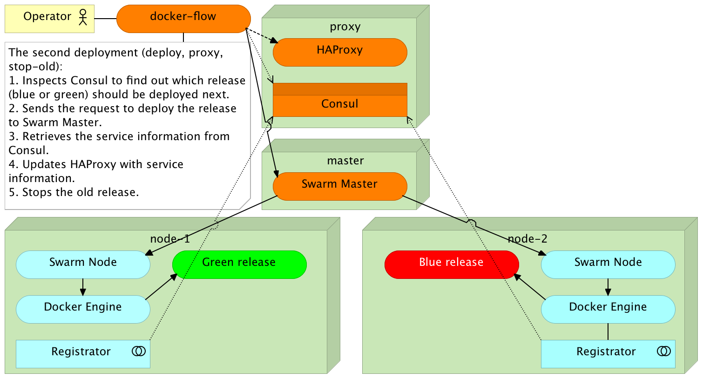

Throughout the first three steps of the flow, HAProxy continues sending all requests to the old release. As the result, users are oblivious that deployment is in progress.

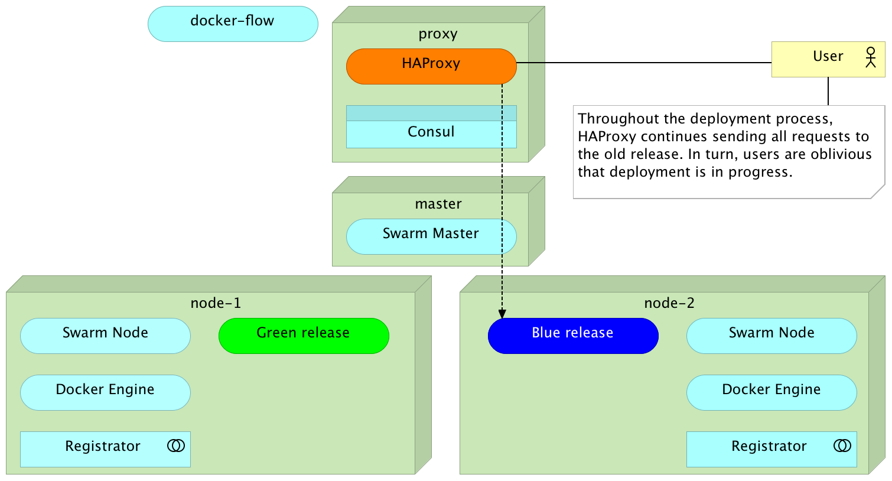

Only after the deployment is finished, HAProxy is reconfigured and users are redirected to the new release. As the result, there was no downtime caused by deployment.

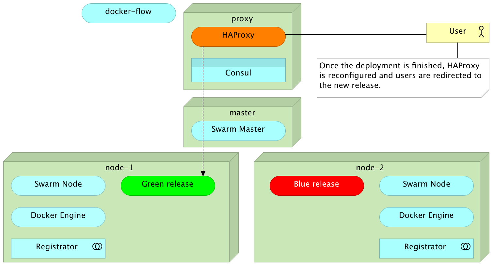

Now that we have a safe way to deploy new releases, let us turn our attention to relative scaling.

### Scaling the service

One of the great benefits *Docker Compose* provides is scaling. We can use it to scale to any number of instances. However, it allows only absolute scaling. We cannot instruct *Docker Compose* to apply relative scaling. That makes the automation of some of the processes difficult. For example, we might have an increase in traffic that requires us to increase the number of instances by two. In such a scenario, the automation script would need to obtain the number of instances that are currently running, do some simple math to get to the desired number, and pass the result to Docker Compose. On top of all that, proxy still needs to be reconfigured as well. *Docker Flow* makes this process much easier.

Let's see it in action.

```bash
docker-flow \
    --scale="+2" \
    --flow=scale --flow=proxy
```

The scaling result can be observed by listing the currently running Docker processes.

```bash
docker ps --format "table {{.Names}}\t{{.Image}}\t{{.Status}}"
```

The output of the `ps` command is as follows.

```
NAMES                        IMAGE                     STATUS
node-2/booksms_app-green_2   vfarcic/books-ms:latest   Up 5 seconds
node-1/booksms_app-green_3   vfarcic/books-ms:latest   Up 6 seconds
node-1/booksms_app-green_1   vfarcic/books-ms:latest   Up 40 minutes
node-1/books-ms-db           mongo                     Up 53 minutes
```

The number of instances was increased by two. While only one instance was running before, now we have three.

Similarly, the proxy was reconfigured as well and, from now on, it will load balance all requests between those three instances.

The flow of the events was as follows.

1. **Docker Flow** inspected *Consul* to find out how many instances are currently running.
2. Since only one instance was running and we specified that we want to increase that number by two, **Docker Flow** sent the request to *Swarm Master* to scale the *green* release to three, which, in turn, decided to run one container on *node-1* and the other on *node-2*. *Registrator* detected the new events created by *Docker Engine* and registered two new instances in *Consul*.
3. **Docker Flow** retrieved the service information from *Consul*.
4. **Docker Flow** updated *HAProxy* with service information and set it up to perform load balancing among all three instances.

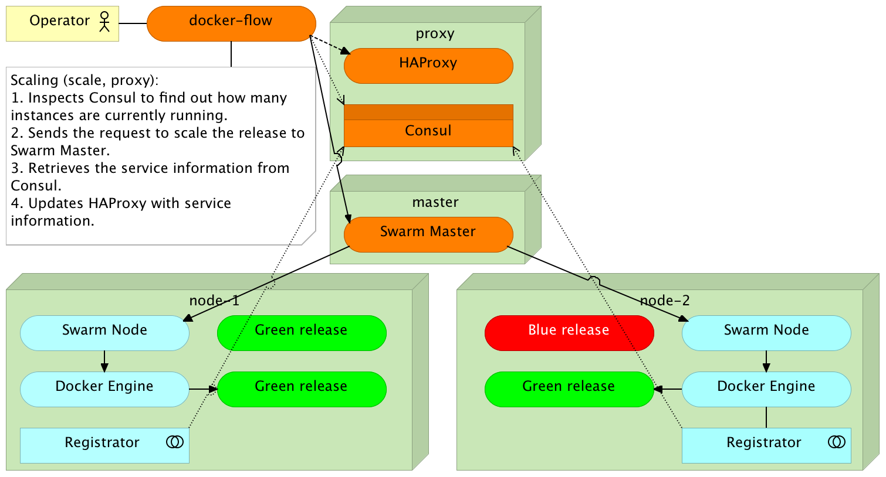

From the users perspective, they continue receiving responses from the current release but, this time, their requests are load balanced among all instances of the service. As a result, service performance is improved.

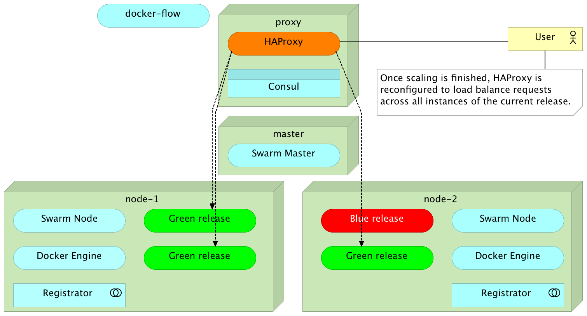

We can use the same method to de-scale the number of instances by prefixing the value of the `--scale` argument with the minus sign (*-*). Following the same example, when the traffic returns to normal, we can de-scale the number of instances to the original amount by running the following command.

```bash
docker-flow \
    --scale="-1" \
    --flow=scale --flow=proxy
```

Testing Deployments to Production
---------------------------------

The major downside of the proxy examples we run by now is the inability to verify the release before reconfiguring the proxy. Ideally, we should use the blue-green process to deploy the new release in parallel with the old one, run a set of tests that validate that everything is working as expected, and, finally, reconfigure the proxy only if all tests were successful. We can accomplish that easily by running `docker-flow` twice.

> Many tools aim at providing zero-downtime deployments but only a few of them (if any), take into account that a set of tests should be run before the proxy is reconfigured.

First, we should deploy the new version.

```bash
docker-flow \
    --flow=deploy
```

Let's list the Docker processes.

```bash
docker ps --format "table {{.Names}}\t{{.Status}}\t{{.Ports}}"
```

The output of the `ps` command is as follows.

```
node-1/booksms_app-blue_2    Up 8 minutes        10.100.192.201:32773->8080/tcp
node-2/booksms_app-blue_1    Up 8 minutes        10.100.192.202:32771->8080/tcp
node-2/booksms_app-green_2   Up About an hour    10.100.192.202:32770->8080/tcp
node-1/booksms_app-green_1   Up 2 hours          10.100.192.201:32771->8080/tcp
node-1/books-ms-db           Up 2 hours          27017/tcp
```

At this moment, the new release (*blue*) is running in parallel with the old release (*green*). Since we did not specify the *--flow=proxy* argument, the proxy is left unchanged and still redirects to all the instances of the old release. What this means is that the users of our service still see the old release while we have the opportunity to test it. We can run integration, functional, or any other type of tests and validate that the new release indeed meets the expectations we have. While testing in production does not exclude testing in other environments (e.g. staging), this approach gives us greater level of trust by being able to validate the software under exactly the same circumstances our users will use it, while, at the same time, not affecting them during the process (they are still oblivious of the existence of the new release).

> Please note that even though we did not specify the number of instances that should be deployed, *Docker Flow* deployed the new release and scaled it to the same number of instances as we had before.

The flow of the events was as follows.

1. **Docker Flow** inspected *Consul* to find out the color of the current release and how many instances are currently running.
2. Since two instances of the old release (*green*) we running and we didn't specify that we want to change that number, **Docker Flow** sent the request to *Swarm Master* to deploy the new release (*blue*) and scale it to two instances.

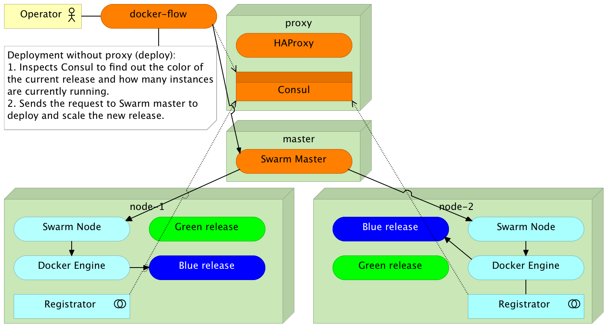

From the users perspective, they continue receiving responses from the current release since we did not specify that we want to reconfigure the proxy.

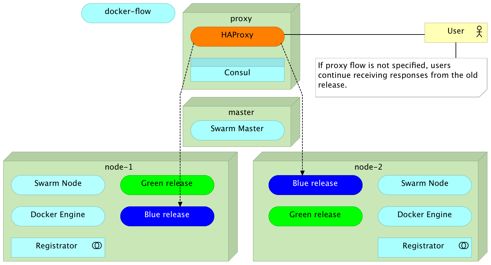

From now on, you can run tests in production against the new release. Assuming that you do not overload the server (e.g. stress tests), tests can run for any period of time without affecting users.

After the tests are run, we have two paths we can take. If one of the tests failed, we can just stop the new release and fix the problem. Since the proxy is still redirecting all requests to the old release, our users would not be affected by a failure, and we can dedicate our time towards fixing the problem. On the other hand, if all tests were successful, we can run the rest of the *flow* that will reconfigure the proxy and stop the old release.

```bash
docker-flow \
    --flow=proxy --flow=stop-old
```

The command reconfigured the proxy and stopped the old release.

The flow of the events was as follows.

1. **Docker Flow** inspected *Consul* to find out the color of the current release and how many instances are currently running.
2. **Docker Flow** updated the proxy with service information.
3. **Docker Flow** stopped the old release.

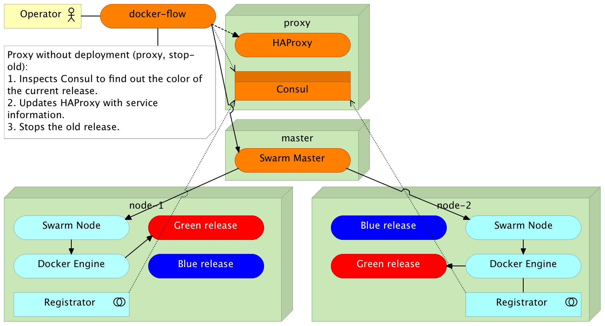

From the users perspective, all new requests are redirected to the new release.

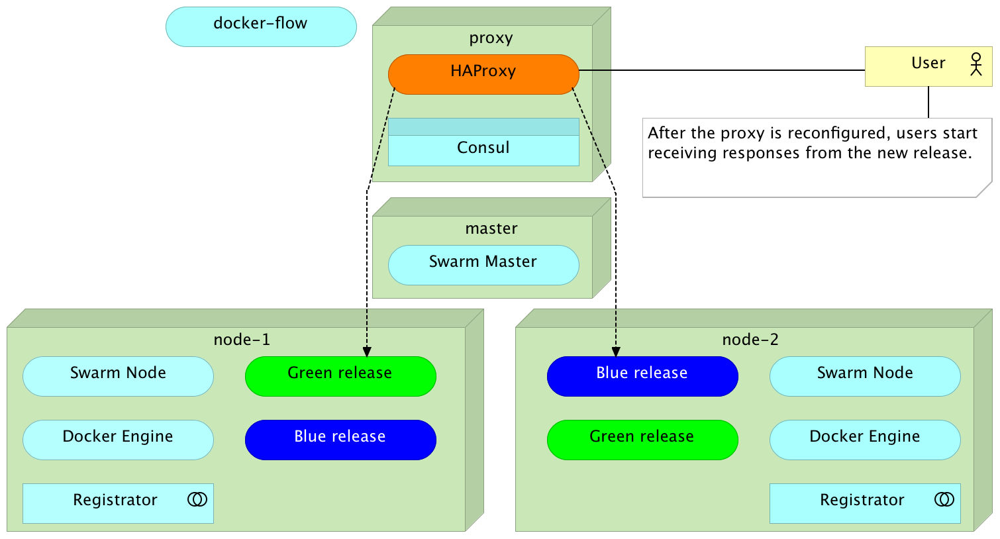

That concludes the quick tour through some of the features *Docker Flow* provides. Please explore the [Usage](#usage) section for more details.